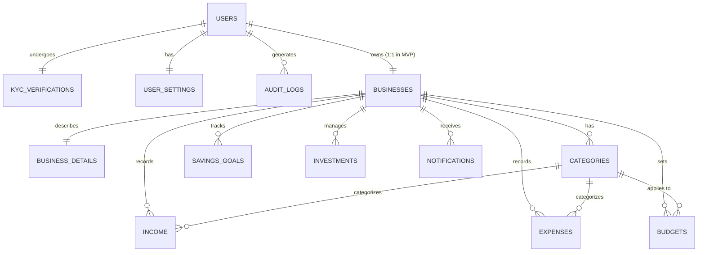

# AFAB Enterprise Database Schema Documentation

This document outlines the professional, scalable, and enterprise-grade database schema for the **AFAB (AI Finance Assistant)** backend. It is designed to meet strict FinTech standards, including robust identity verification (KYC), detailed business profiles, comprehensive security logging, and precise financial tracking.

> [!IMPORTANT]
> **Core Architectural Rule (PR-004 & PR-001):** 
> 1. Each registered user owns and manages exactly **one** business in Version 1. 
> 2. Every financial entity in the system MUST belong to a **Business**, not directly to a User.

---

## Entity Relationship Diagram (ERD)

---

## 1. Core Identity, Security & KYC

### `users`
The core authentication and identity table.
*   **`id`** (BIGINT, Primary Key)
*   **`email`** (CITEXT, Unique, Not Null)
*   **`password_hash`** (VARCHAR, Not Null)
*   **`first_name`** (VARCHAR, Not Null)
*   **`last_name`** (VARCHAR, Not Null)
*   **`phone_number`** (VARCHAR, Unique)
*   **`phone_verified_at`** (TIMESTAMP)
*   **`email_verified_at`** (TIMESTAMP)
*   **`two_factor_enabled`** (BOOLEAN, Default false)
*   **`two_factor_secret`** (VARCHAR) - Encrypted TOTP secret.
*   **`last_login_at`** (TIMESTAMP)
*   **`last_login_ip`** (VARCHAR)
*   **`status`** (VARCHAR) - `ACTIVE`, `SUSPENDED`, `BANNED`.
*   **`created_at`**, **`updated_at`**, **`deleted_at`** (TIMESTAMP)

### `kyc_verifications`
Handles identity verification (Know Your Customer) documents and approval status.
*   **`id`** (BIGINT, Primary Key)
*   **`user_id`** (BIGINT, Foreign Key -> `users`, Unique)
*   **`document_type`** (VARCHAR) - `NATIONAL_ID`, `PASSPORT`, `DRIVERS_LICENSE`.
*   **`document_front_url`** (VARCHAR) - Secure MinIO link.
*   **`document_back_url`** (VARCHAR, Nullable)
*   **`selfie_url`** (VARCHAR, Nullable)
*   **`document_number`** (VARCHAR) - Hashed or encrypted at rest.
*   **`status`** (VARCHAR) - `PENDING`, `APPROVED`, `REJECTED`, `EXPIRED`.
*   **`rejection_reason`** (TEXT)
*   **`verified_at`** (TIMESTAMP)
*   **`created_at`**, **`updated_at`** (TIMESTAMP)

### `audit_logs`
Tracks critical security and data changes for compliance.
*   **`id`** (BIGINT, Primary Key)
*   **`user_id`** (BIGINT, Foreign Key -> `users`)
*   **`action`** (VARCHAR) - e.g., `LOGIN_SUCCESS`, `PASSWORD_CHANGED`, `EXPENSE_DELETED`.
*   **`entity_type`** (VARCHAR) - e.g., `Expense`, `User`.
*   **`entity_id`** (BIGINT)
*   **`ip_address`** (VARCHAR)
*   **`user_agent`** (VARCHAR)
*   **`details`** (JSONB) - Snapshot of changes.
*   **`created_at`** (TIMESTAMP)

### `user_settings`
Granular user preferences.
*   **`id`** (BIGINT, Primary Key)
*   **`user_id`** (BIGINT, Foreign Key -> `users`, Unique)
*   **`theme`** (VARCHAR) - `LIGHT`, `DARK`, `SYSTEM`.
*   **`language`** (VARCHAR, Default 'en-US')
*   **`timezone`** (VARCHAR, Default 'UTC')
*   **`date_format`** (VARCHAR, Default 'YYYY-MM-DD')
*   **`currency_display`** (VARCHAR) - `SYMBOL`, `CODE`, `NAME`.
*   **`email_notifications`** (BOOLEAN, Default true)
*   **`push_notifications`** (BOOLEAN, Default false)
*   **`created_at`**, **`updated_at`** (TIMESTAMP)

---

## 2. Business Management

### `businesses`
The aggregate root for financial data.
*   **`id`** (BIGINT, Primary Key)
*   **`user_id`** (BIGINT, Foreign Key -> `users`, Unique in V1)
*   **`name`** (VARCHAR, Not Null)
*   **`base_currency`** (VARCHAR, Default 'USD', Not Null)
*   **`status`** (VARCHAR) - `ACTIVE`, `INACTIVE`.
*   **`created_at`**, **`updated_at`**, **`deleted_at`** (TIMESTAMP)

### `business_details`
Extended legal and contact information for the business.
*   **`id`** (BIGINT, Primary Key)
*   **`business_id`** (BIGINT, Foreign Key -> `businesses`, Unique)
*   **`legal_name`** (VARCHAR)
*   **`tax_id_number`** (VARCHAR) - VAT, EIN, etc.
*   **`registration_number`** (VARCHAR)
*   **`industry_type`** (VARCHAR)
*   **`contact_email`** (VARCHAR)
*   **`contact_phone`** (VARCHAR)
*   **`website_url`** (VARCHAR)
*   **`logo_url`** (VARCHAR)
*   **`address_line1`** (VARCHAR)
*   **`address_line2`** (VARCHAR)
*   **`city`** (VARCHAR)
*   **`state_province`** (VARCHAR)
*   **`postal_code`** (VARCHAR)
*   **`country_code`** (VARCHAR(2))
*   **`created_at`**, **`updated_at`** (TIMESTAMP)

---

## 3. Financial Core (Transactions)

### `categories`
Used to categorize both income and expenses.
*   **`id`** (BIGINT, Primary Key)
*   **`business_id`** (BIGINT, Foreign Key -> `businesses`)
*   **`name`** (VARCHAR, Not Null)
*   **`type`** (VARCHAR, Not Null) - `INCOME` or `EXPENSE`.
*   **`color_hex`** (VARCHAR(7))
*   **`icon_name`** (VARCHAR)
*   **`is_system_default`** (BOOLEAN, Default false)
*   **`created_at`**, **`updated_at`**, **`deleted_at`** (TIMESTAMP)

### `income`
Professional income tracking with payment methods and statuses.
*   **`id`** (BIGINT, Primary Key)
*   **`business_id`** (BIGINT, Foreign Key -> `businesses`)
*   **`category_id`** (BIGINT, Foreign Key -> `categories`)
*   **`amount`** (DECIMAL(19,4), Not Null)
*   **`date`** (DATE, Not Null)
*   **`title`** (VARCHAR, Not Null)
*   **`description`** (TEXT)
*   **`payment_method`** (VARCHAR) - `BANK_TRANSFER`, `CASH`, `CREDIT_CARD`, `CRYPTO`, `STRIPE`, `PAYPAL`.
*   **`status`** (VARCHAR) - `PENDING`, `CLEARED`, `FAILED`.
*   **`reference_number`** (VARCHAR) - Invoice or transaction ID.
*   **`is_recurring`** (BOOLEAN, Default false)
*   **`recurring_interval`** (VARCHAR) - `DAILY`, `WEEKLY`, `MONTHLY`, `YEARLY`.
*   **`created_at`**, **`updated_at`**, **`deleted_at`** (TIMESTAMP)

### `expenses`
Professional expense tracking supporting receipt uploads and vendor references.
*   **`id`** (BIGINT, Primary Key)
*   **`business_id`** (BIGINT, Foreign Key -> `businesses`)
*   **`category_id`** (BIGINT, Foreign Key -> `categories`)
*   **`amount`** (DECIMAL(19,4), Not Null)
*   **`date`** (DATE, Not Null)
*   **`title`** (VARCHAR, Not Null)
*   **`vendor_name`** (VARCHAR)
*   **`description`** (TEXT)
*   **`payment_method`** (VARCHAR)
*   **`status`** (VARCHAR) - `PENDING`, `CLEARED`, `VOIDED`.
*   **`receipt_url`** (VARCHAR) - Secure MinIO link.
*   **`tax_deductible`** (BOOLEAN, Default false)
*   **`is_recurring`** (BOOLEAN, Default false)
*   **`recurring_interval`** (VARCHAR)
*   **`created_at`**, **`updated_at`**, **`deleted_at`** (TIMESTAMP)

---

## 4. Financial Planning & Assets

### `budgets`
Advanced budgeting supporting rollover and alerts.
*   **`id`** (BIGINT, Primary Key)
*   **`business_id`** (BIGINT, Foreign Key -> `businesses`)
*   **`category_id`** (BIGINT, Foreign Key -> `categories`, Nullable) - Null for global business budget.
*   **`amount`** (DECIMAL(19,4), Not Null)
*   **`period`** (VARCHAR, Not Null) - `MONTHLY`, `QUARTERLY`, `YEARLY`.
*   **`start_date`** (DATE)
*   **`end_date`** (DATE)
*   **`rollover_unused`** (BOOLEAN, Default false) - Carry forward remaining budget.
*   **`alert_threshold_percent`** (INTEGER, Default 80) - Warn when 80% used.
*   **`created_at`**, **`updated_at`** (TIMESTAMP)

### `savings_goals`
*   **`id`** (BIGINT, Primary Key)
*   **`business_id`** (BIGINT, Foreign Key -> `businesses`)
*   **`name`** (VARCHAR, Not Null)
*   **`target_amount`** (DECIMAL(19,4), Not Null)
*   **`current_amount`** (DECIMAL(19,4), Default 0)
*   **`deadline`** (DATE)
*   **`auto_save_amount`** (DECIMAL(19,4)) - Amount to allocate periodically.
*   **`color_hex`** (VARCHAR(7))
*   **`created_at`**, **`updated_at`**, **`deleted_at`** (TIMESTAMP)

### `investments`
Manual asset tracking with extreme precision for crypto.
*   **`id`** (BIGINT, Primary Key)
*   **`business_id`** (BIGINT, Foreign Key -> `businesses`)
*   **`name`** (VARCHAR, Not Null)
*   **`ticker_symbol`** (VARCHAR) - e.g., `AAPL`, `BTC`.
*   **`asset_class`** (VARCHAR, Not Null) - `STOCK`, `CRYPTO`, `REAL_ESTATE`, `MUTUAL_FUND`, `BOND`.
*   **`quantity`** (DECIMAL(24,8), Not Null) - Allows up to 8 decimal places for crypto.
*   **`purchase_price_total`** (DECIMAL(19,4))
*   **`current_value_total`** (DECIMAL(19,4))
*   **`purchase_date`** (DATE)
*   **`platform_name`** (VARCHAR) - e.g., "Binance", "Robinhood".
*   **`created_at`**, **`updated_at`**, **`deleted_at`** (TIMESTAMP)

---

## 5. System Notifications

### `notifications`
System alerts for the business.
*   **`id`** (BIGINT, Primary Key)
*   **`business_id`** (BIGINT, Foreign Key -> `businesses`)
*   **`title`** (VARCHAR, Not Null)
*   **`message`** (TEXT, Not Null)
*   **`type`** (VARCHAR, Not Null) - `SECURITY`, `BUDGET_ALERT`, `GOAL_COMPLETED`, `PAYMENT_REMINDER`.
*   **`action_url`** (VARCHAR) - Link to resolve the notification.
*   **`is_read`** (BOOLEAN, Default false)
*   **`created_at`** (TIMESTAMP)

---

## Data Architecture Principles

1.  **JSONB for Flexibility**: The `audit_logs.details` uses PostgreSQL `JSONB` to store rich, queryable snapshots of data changes without schema migrations.
2.  **CITEXT**: The `users.email` uses the `CITEXT` extension to prevent duplicate case-sensitive emails (`Admin@afab.com` vs `admin@afab.com`).
3.  **High Precision DECIMAL**: `investments.quantity` uses `DECIMAL(24,8)` to support exact fractional shares and cryptocurrencies, avoiding IEEE 754 floating-point rounding errors.
4.  **MinIO Document Storage**: Sensitive documents (KYC passports, expense receipts) will be stored in the self-hosted MinIO object storage, with the database only storing the secure reference URLs.
